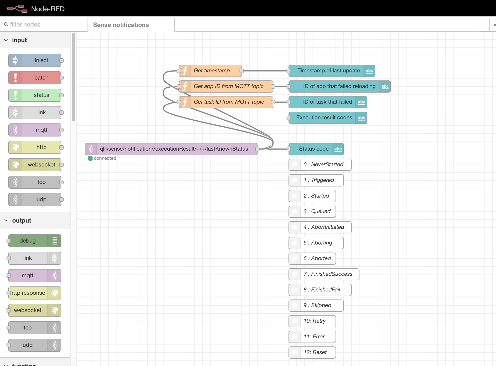

# Forwarding Qlik Sense event notifications to MQTT messages

This repository is all about making it as easy as possible to get started with and using the Qlik Sense notification API.

## Rationale

[Qlik Sense](https://www.qlik.com/us/products/qlik-sense) offers a very powerful, but somewhat hard to use [notification API](https://help.qlik.com/en-US/sense-developer/September2018/Subsystems/RepositoryServiceAPI/Content/Sense_RepositoryServiceAPI/RepositoryServiceAPI-Notification-Create-Change-Subscription.htm).

Through this API you can get notified when all kinds of events happen in a Sense environment.
The API is in fact extremely rich, you can get notified when almost *anything* happens...
Notifications examples include

* Task failures
* Reload task progress
* Apps being published, updated or deleted
* Sheets being updated
* The details of a specific user are changed
* ...

This is all good, except that the notification API is somewhat hard to get started with and use.
You need to set up some kind of authentication to QRS, set up a REST server which QRS can call/notify when the subscribed to events occur, you also need to register callbacks for all QRS events you are interested in etc.

Fine if you have a well defined project that you want to create an optimized program for, but somwhat of a pain if you just want to try out the Qlik Sense notification features.

The "Butler Notifier" makes it a lot easier to set up and use Qlik Sense notifications in both prototype and production contexts:

* All configuration is done in YAML config files
  * One file defines QRS specific parameters like certificates, IP addresses of the QRS server etc
  * One file defines what QRS events to subscribe to
* The application handles everything around setting up callbacks that QRS will use to notify about the subscribed to events
* All events are forwarded as MQTT messages, which can be acted upon by downstream services.

Running the gateway and having it subscribe to reload task events looks like this:

Setting the debug level to 'debug' will greatly increase the information logged to console and disk log files.

### Limitations

As of this writing, you can get MQTT notifications for the following Qlik Sense object types:

* ExecutionResult
* User

Please note that the app itself can subscribe to notifications for any object type - it's just the forwarding to MQTT messages that is currently limited to the above object types.
Support for additional object types can be added if/when needed.

## The config files

Both config files are in YAML, which makes them easy to read and understand.
Event subscriptions are defined in notification.yaml, which can look like this:

The syntax used in `notification.yaml` is the same as in the underlying Qlik Sense notification API. Thus, [Qlik's help pages](https://help.qlik.com/en-US/sense-developer/September2018/Subsystems/RepositoryServiceAPI/Content/Sense_RepositoryServiceAPI/RepositoryServiceAPI-Notification-Create-Change-Subscription.htm) come in handy when defining what notifications are of interest.

The file where more general settings are defined looks like this:

### Running in Docker

New releases of Butler Notifier are automatically packaged as Docker images and pushed to [Docker Hub](https://hub.docker.com/u/ptarmiganlabs/).
This together with the supplied `docker-compose.yml` file makes it easy to run Butler Notifier as a Docker container.

Before using `docker-compose` to start Butler Notifier in a Docker container, you must edit the NODE_ENV setting in the `docker-compose.yml` file. The value of that setting should match the name of your main config file. 

For example, if you main config file is called `production.yaml`, the NODE_ENV variable should be set to `production` in the `docker-compose.yml` file.

## What is MQTT

[MQTT](https://en.wikipedia.org/wiki/MQTT) is a machine-to-machine messaging protocol. It is widely used in Internet of Things applications, but works equally well for server based messaging.

By *publishing* the QRS events as MQTT *messages* in well defined *topics*, other applications or services can then *subscribe* to the topics of interest, and be notified in real time when new messages arrive.
MQTT thus uses a "publish-subscribe", or pub-sub concept.

In order to use MQTT an "MQTT broker" is needed. [Mosquitto](https://mosquitto.org/) is a good open source option - it has been around for some years and is mature and stable.

A good intro to MQTT is found [here](https://www.hivemq.com/blog/how-to-get-started-with-mqtt).

## MQTT topics used in Butler Notifier

The base MQTT topic root used by Butler Notifier is defined in the `mqttConfig.baseTopic` section of the main configuration file (production.yaml, development.yaml or similar).

If in doubt what to use as the base topic, "qliksense/notification/" is a good start.

The following MQTT topics are used by Butler Notifier: 

### Object type: Execution result

    # A task's most recent reported reload status (triggered, queued, running, failed etc)
    qliksense/notification/executionResult/<appId>/<taskId>/lastKnownStatus

    # A task's most recent, complete reload state. This is usually a fairly large JSON
    qliksense/notification/executionResult/<appId>/<taskId>/lastKnownFullState

    # The complete reload state, published to a topic specific for the current result code
    qliksense/notification/executionResult/<appId>/<taskId>/<resultCode>

### Object type: User

    # A user's most recent, complete state
    qliksense/notification/user/<userDirectory>/<userId>/lastKnownFullState

    # The most recent user notification received
    qliksense/notification/user/lastMessage

## Using MQTT messages

There are lots of good client side libraries for MQTT, making it easy to use the MQTT messages (or rather the QRS events!) in your applications.

### Node-RED

A great way to get started is to use [Node-RED](https://nodered.org/), which is an open source visual development environment with great MQTT support.
While Node-RED is promoted as a prototyping tool for IoT applications, it is very stable and lots of people use it in prodcution settings. But as always - try these things in a sandbox/lab environment before deploying into production environments.

A sample Node-RED flow showing the last execution result info for Qlik Sense tasks can look like this:

### MQTT.fx

[MQTT.fx](https://mqttfx.jensd.de/) a nice cross platform MQTT client. Works well on most popular operating systems.

On Mac OS this app seems to be quite resource hungry, but that may just as well be some issue with the computer the app was tested on.

### MQTTBox

[MQTTBox](http://workswithweb.com/mqttbox.html) is another cross platform MQTT client. It uses a pane-based UI concept, which in some cases works great, while in other cases can be a bit limiting.

## Links and references

* The [QRS help pages](https://help.qlik.com/en-US/sense-developer/September2018/Subsystems/RepositoryServiceAPI/Content/Sense_RepositoryServiceAPI/RepositoryServiceAPI-Notification-Create-Change-Subscription.htm) provide info on the syntax used to define what QRS events to subscribe to
* The fine folks in Qlik's enterprise architecture team has a good [blog post](https://eablog.qlikpoc.com/2018/11/01/qlik-sense-repository-notification-api/) describing the concepts of the notification API, including some good examples. Highly recommended reading.
